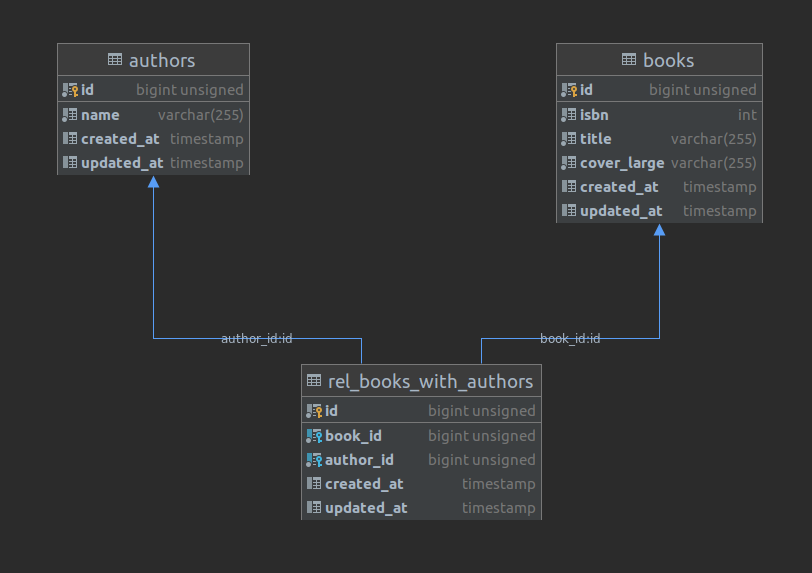

## Entregables

* EndPoint de Creación de libros consumiendo OpenLibrary y obteniendo la información del libro
  por el ISBN.

* EndPoint para listado de libros paginados de dos en dos implementando Resources y Collections
* EndPoint para ver detalle del libro por ISBN, (ISBN, Título, Autor/es, carátula) con respuesta en XML.
* EndPoint para eliminar el libro pasando ISBN con respuesta en JSON.
* Interfaz en HTML para visualizar el listado de libros paginado con botón de eliminar.
* Colección de endpoint's y variables de entorno para uso en POSTMAN
---
## Diagrama entidad relación



---
## Comandos para ejecución

```
// Instalación de paquetes
composer install

// Creación de archivo de entorno
php -r "file_exist('.env') || copy('.env.example', '.env');"

// Creación de key
php artisan key:generate --ansi

// Ejecución de migraciones
php artisan migrate

// Puesta en marcha
php artisan serve
```
---
## Notas Técnicas: 
Importar tanto la colección como las variables de entorno en POSTMAN para su ejecución
* [Colección](documentation/postman/MetaBibliotecaCollection.postman_collection.json)
* [Variables de entorno](documentation/postman/MetaBibliotecaEnvironment.postman_environment.json)
* Recordar dar valor a las variables de entorno ISBN que corresponde al identificador proporcionado por ustedes así como 
la variable de entorno Domain.

Se usó
```
PHP 7.2.11 (cli) (built: Oct 10 2018 02:04:04) ( NTS MSVC15 (Visual C++ 2017) x64 )
Copyright (c) 1997-2018 The PHP Group
Zend Engine v3.2.0, Copyright (c) 1998-2018 Zend Technologies
with Xdebug v3.0.3, Copyright (c) 2002-2021, by Derick Rethans
```

```
Composer version 2.0.8
```

```
Laravel Framework 7.30.4
```


